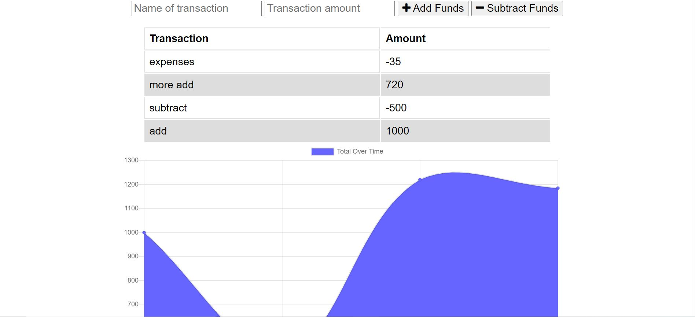

# BudgetTracker

## Overview

a budget tracker that allows user to keep track of their budget when they are online and even when they are offline.

## Usage

to use this app, copy the link below to a browser:

https://intense-bayou-53543.herokuapp.com/

## How it works

Simply specify what kind of transaction and choose the action. The transaction made is store even when the app is offline

## Issue

Currently there are no issue

## License

MIT

## Technologies

